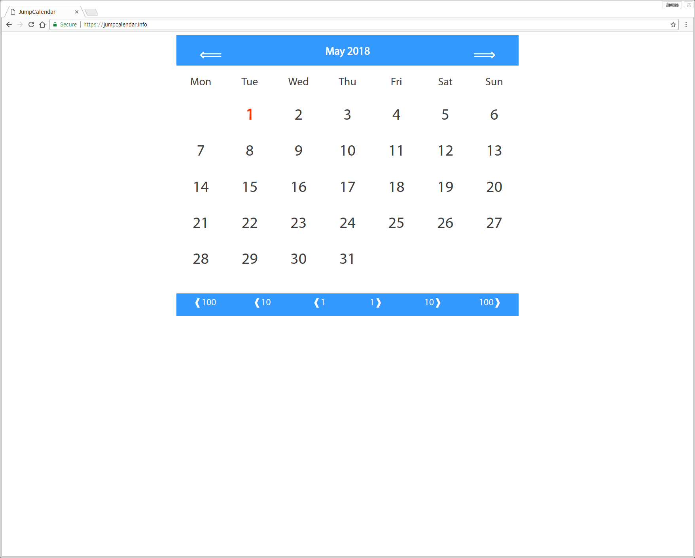

# jumpcalendar.info

### Explore the days of the month in any given year

* What day was it on the 1st of March 1998?

* How many Thurdays were there in April 1922?

* When was the last weekend in January 2010?

Jump forward or back by month, year, decade or century to find out.

